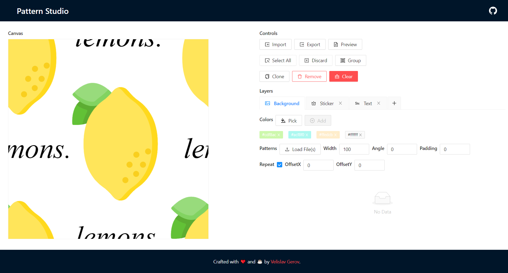

# Pattern Studio
A tool to create configurable tiles that assemble as patterns for print.

## 🚀 Check out live
The latest version is deployed to Heroku at [pattern-studio.gerov.dev](https://pattern-studio.gerov.dev/ "Link to Pattern Studio deployment on Heroku")

## 📜 Background
Pattern Studio was created as a solution for the following requirements:
- Create a __tile__ that can be repeated to assemble a __pattern__
- Compose a __tile__ from different __elements__ - _background_, _sticker_ and _text_
- Group multiple interchangeable __elements__ to create a __configurable pattern__

An example use case for a __configurable pattern__ is to be incorporated in an online shop that sells prints. 

## 📸 Screenshot


## 👀 Examples
- [Example tile](pattern.svg "Example tile") - SVG format, can be used to assemble a pattern in a tool like Adobe Illustrator
- [Example pattern, ready for print](pattern.png "Example pattern, ready for print") - PNG format, the pattern is assembled and ready for print
- [Example pattern.json, ready for import](pattern.json "Example pattern.json, ready for import") - JSON format, the pattern can be imported in Pattern Studio

## 🛠️ Technology
This is a client-side web application that relies on Fabric.js, React, Ant Design, and builds with Babel and Webpack.

## ⌨️ Start hacking
#### Get the repo:
```bash
git clone https://github.com/velislavgerov/pattern-studio.git
cd pattern-studio
```
#### Install the dependecnies:
```bash
yarn install
```

#### Start the development server:
```bash
yarn dev
```

By default, the development server will start on [localhost:8080](http://localhost:8080/ "Link to default development server")
